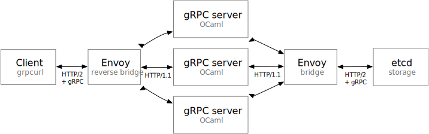

This is the HTTP/2 branch. Here, Envoy is not strictly required for gRPC requests, but still important in a production environment.

---

This project shows how to implement a gRPC server and a gRPC client using OCaml and [Envoy](https://www.envoyproxy.io/), a very useful proxy open-sourced by Lyft and now part of the [CNCF](https://www.cncf.io/).

The idea is use Envoy to translate between HTTP/1.1 and HTTP/2 gRPC. Note that Envoy appears twice on the diagram, but it's actually the same process.

In this example, we expose a simple gRPC service written in OCaml that uses [etcd](https://etcd.io/) to store key/value pairs. This showcases both a gRPC server and a client.





This architecture adds one process (Envoy) compared to a native gRPC implementation in OCaml. While this adds an ounce of complexity, Docker makes it easy to manage and your project will already include a great little proxy to handle load balancing, connection pooling, stats, retries and more. For instance, it is trivial to configure Envoy to load balance between many OCaml processes each running on a single core.

We use these OCaml libraries:

- [ocaml-protoc](https://github.com/mransan/ocaml-protoc) to encode and decode Protobuf request and response messages
- [httpaf](https://github.com/inhabitedtype/httpaf) to
  - serve HTTP/1.1 requests that have been translated from HTTP/2 by Envoy (gRPC server use case)
  - issue HTTP/1.1 requests that Envoy will translate to HTTP/2 before forwarding them to our gRPC service of choice (gRPC client use case)

## Running the code

Tested on macOS and Linux. Requires:
- `docker` to run Envoy and etcd
- `dune` and `opam` to build our code
- `grpcurl` to query our service

```
# create a Docker environment with Envoy and etcd
docker network create \
               --driver bridge \
               my-net

if [ $(uname) = Linux ]; then
  IP=$(ip -o addr list docker0 | grep -oe 'inet [0-9.]*/' | tr -d 'inet /')
  DOCKER_OPTS="--add-host host.docker.internal:$IP"
fi

docker run --name envoy \
           --detach \
           --rm \
           --publish 9910:9910 \
           --publish 9911:9911 \
           --publish 9912:9912 \
           --volume $PWD/envoy-proxy.yaml:/etc/envoy/envoy.yaml \
           $DOCKER_OPTS \
           --network my-net \
           --network-alias envoy.my-net \
           envoyproxy/envoy:v1.15-latest \
           --config-path /etc/envoy/envoy.yaml
           
docker run --name etcd \
           --detach \
           --rm \
           --publish 2379:2379 \
           --network my-net \
           --network-alias etcd.my-net \
           quay.io/coreos/etcd:latest \
           etcd \
           --listen-client-urls 'http://0.0.0.0:2379' \
           --advertise-client-urls 'http://etcd.my-net:2379'
           
# run our OCaml server
opam install --yes dune core_kernel h2 h2-lwt-unix lwt ocaml-protoc
dune exec -- ./main.exe 9986
           
# in another terminal, you can query our OCaml server via Envoy, which in turn will query etcd via Envoy
( cd kv && \
  grpcurl --plaintext \
          --proto kv_service.proto \
          -d '{"key":"foo", "value":"bar"}' \
          localhost:9912 kv.KV/Set )
( cd kv && \
  grpcurl --plaintext \
          --proto kv_service.proto \
          -d '{"key":"foo"}' \
          localhost:9912 kv.KV/Get )

# clean up everything
docker rm --force etcd envoy
docker network rm my-net
```

## Regenerating Protobuf code

```
( cd kv && ocaml-protoc -binary -ml_out ./ kv.proto )
( cd etcd && ocaml-protoc -binary -ml_out ./ etcd.proto )
```

